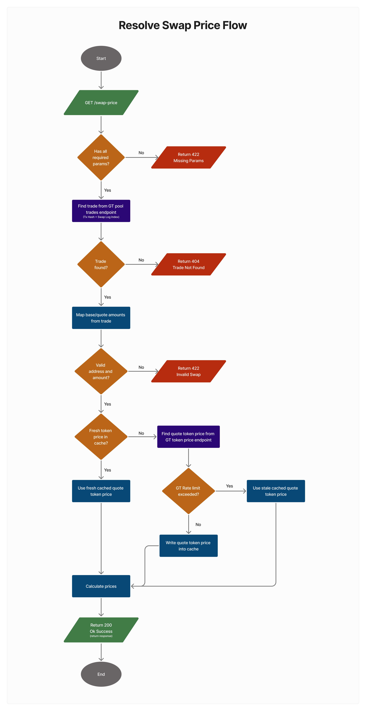

# Swap Price Resolver API

An API service that resolves swap price from GeckoTerminal pool swaps by transaction hash and log index, with caching on quote-token prices to work around GT free tier rate limits.

---

## Setup and Dependencies

This project is built using **Ruby on Rails** as an API-only application.

### Core Dependencies

- **Ruby 3.4.6**

For full dependency details, see [`Gemfile`](Gemfile)

### Local Setup

1. Install dependencies:

   ```bash
   bundle install
   ```

2. Start the server:

   ```bash
   bin/rails server
   ```

3. Open the API swagger docs:
   - [http://localhost:3000/swagger](http://localhost:3000/swagger)

---

## Caching Strategy

Only **quote token USD prices** from GeckoTerminal are cached. **Pool trades** are read on every request (see [`SwapPriceHandler`](app/services/swap_price_handler.rb)).

- **Fresh cache:** After a successful `token_price` call, the result is stored under a per-network, per-quote-token key for **1 minute**. A cache hit skips the upstream price request.
- **Stale cache:** The same payload is also written to a separate stale key for **24 hours**. During normal operation this entry is not read; it exists so token-price requests can fall back when GeckoTerminal is rate limiting (see **Rate limits** below).

---

## Rate limits

GeckoTerminal applies its own quotas (**10 requests per minute** on the free tier).

- **Quote token USD price (`token_price`):** If the upstream call is rate limited, the service tries the **stale** cached price (see **Caching strategy**). If one exists, the request **succeeds** with that snapshot. If not, the API returns **503** with an error body.
- **Pool trades:** Trades are not cached because GeckoTerminal only exposes **recent activity** (the **last 24 hours** and the **latest 300 trades**), and we want each request to read the **current** list so swap lookup matches what is available upstream. If loading pool trades is rate limited, there is **no** stale fallback; the API returns **503** with an error body.

Other upstream or parsing failures are returned as **502** (see [`SwapPricesController`](app/controllers/swap_prices_controller.rb)).

---

## Flowchart

This diagram shows the main request flow for the swap price resolver.



---

## Testing

This backend uses **Minitest** for testing and [**SimpleCov**](https://github.com/simplecov-ruby/simplecov) for coverage, and includes:

- **Client tests** ([`test/clients`](test/clients)): GeckoTerminal HTTP client, response parsing, and error handling.
- **Service tests** ([`test/services`](test/services)): `SwapPriceHandler` resolution, caching, and rate-limit fallback.
- **Integration tests** ([`test/integration`](test/integration)): HTTP API for `/swap-price` (status codes and JSON shape).

### Run Tests

```bash
bin/rails test
```

### Test Coverage

After running tests, open the coverage report at [`coverage/index.html`](coverage/index.html).

---

## Deployed URL

Swap Price Resolver API: [https://amadrailsapi.com/](https://amadrailsapi.com/)

API Swagger Docs: [https://amadrailsapi.com/swagger/](https://amadrailsapi.com/swagger/)

- The API is deployed on a Contabo VPS, with Nginx as a reverse proxy.
